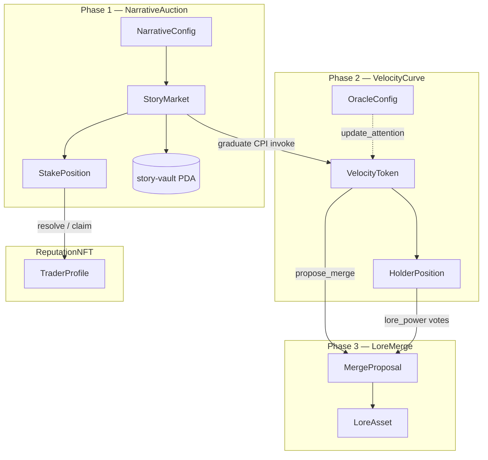

# Bonding Curve Casino — On-Chain Architecture

Founder overview of the Solana / Anchor programs that back the Story Markets UI.

> **Product insight:** traders bet on *narrative velocity* before tokens exist. Phase 1 is a prediction market on stories; Phase 2 tokenizes winners on a dual bonding curve; Phase 3 lets winners absorb failed lore.

---

## 1. Three phases + ReputationNFT

| Phase | Program | Role |
|-------|---------|------|
| **1 — Narrative Auction** | `narrative-auction` | Creators submit stories; users stake SOL; top narratives graduate (or fail) |
| **2 — Velocity Bonding Curve** | `velocity-curve` | Dual-curve AMM (price × attention); oracle-driven sell tax |
| **3 — Lore Merge** | `lore-merge` | Strong tokens absorb failed narratives via community vote |
| **Reputation** | `reputation-nft` | Dynamic trader profiles / tiers from prediction accuracy |

**Program IDs** (synced with `Anchor.toml` / `declare_id!`):

| Program | ID |
|---------|-----|
| NarrativeAuction | `75xWzXGb3A7UgpqDDL9ByVXpaZ8Zw4AF4i7whnVXyh8m` |
| VelocityCurve | `5VbDjccBDNVCPLpSgxyuw7ptYekrcxH8FySBxaAXx6C` |
| LoreMerge | `8pSr3X9iP66rvqMWT4S2gsEGtS8VnCLZtJayY9NB9ySy` |
| ReputationNFT | `DrzQKZpvg8y7Gymp5yz2upX24v3fV7j7eFuqT31Nxgvd` |

---

## 2. Account diagram



### PDA seeds (Phase 1)

| Account | Seeds |
|---------|-------|
| `NarrativeConfig` | `["narrative-config"]` |
| `StoryMarket` | `["story", creator, content_hash]` |
| Story vault | `["story-vault", story]` |
| `StakePosition` | `["stake", story, staker]` |
| `RankingBoard` | `["ranking-board"]` |

### PDA seeds (Phase 2 — VelocityCurve)

| Account | Seeds |
|---------|-------|
| `VelocityToken` | `["curve", story_id]` |
| Curve vault | `["curve-vault", curve]` |
| `HolderPosition` | `["holder", curve, owner]` |
| `OracleConfig` | `["oracle-config"]` |

### PDA seeds (Phase 3 — LoreMerge)

| Account | Seeds |
|---------|-------|
| `MergeConfig` | `["merge-config"]` |
| `MergeProposal` | `["merge", absorber, target]` |
| `LoreAsset` | `["lore", origin_curve]` |
| `VoteRecord` | `["vote", proposal, voter]` |

---

## 3. CPI / lifecycle flow

```
User stakes SOL
    ↓
NarrativeAuction::stake_on_narrative
    (2% fee → treasury, net → story vault)
    ↓  (auction ends_at)
┌─ threshold met + top rank ──▶ graduate_narrative(rank 1–5)
│                                    ↓ CPI invoke (live)
│                               VelocityCurve::initialize_token
│                                    ↓
│                               Oracle → update_attention (every ~5 min)
│
├─ threshold met, not top rank ──▶ forfeit_story
│                                    ↓
│                               contribute_losing_pool → winner winning_pool (20/80)
│
└─ below threshold ──▶ fail_story → resolve_stakes → claim_stake (reclaim)
                              ↓
                    ReputationNFT::update_profile (later)
```

**Graduate redistribution (losers → winner narrative):**

- **20%** of losing stakes → winner stakers (pro-rata) via `winner_bonus_pool`
- **80%** → `liquidity_reserve` for VelocityCurve initial liquidity

---

## 4. Fees

| Surface | Fee | Where |
|---------|-----|-------|
| Narrative Auction stake | **2%** (200 bps) | `NarrativeConfig.fee_bps` → treasury |
| Velocity Curve volume | **1.5%** (150 bps) | `CURVE_FEE_BPS` in velocity-curve |
| Lore Merge execution | **5%** (500 bps) | `MERGE_FEE_BPS` in lore-merge |

---

## 5. What's implemented vs stubbed

| Program | Accounts | Instructions | Logic |
|---------|----------|--------------|-------|
| **narrative-auction** | ✅ Full | ✅ 10 handlers | ✅ Real: config/update, story init, stake + fee, graduate + ranking board + **CPI invoke** to VelocityCurve, fail/forfeit, contribute 20/80 pool, resolve math, claim |
| **velocity-curve** | ✅ Full | ✅ 9 handlers | ✅ Dual-curve math, buy/sell + 1.5% fee, attention EMA, holder rewards, **oracle 3/5 multi-sig crank** (`quorum`, add/remove oracle) |
| **lore-merge** | ✅ Full | ✅ 5 handlers | ✅ propose/vote/execute + lore init; 5% fee; history cap 10; VelocityCurve reads via owner+Borsh (vault settle CPI deferred) |
| **reputation-nft** | ✅ Typed | ✅ `initialize_profile` + `update_profile` + `add_trait` | ✅ Accuracy × Weighted_Volume_Factor + Bronze→Mythic tiers; events/errors; Metaplex mint TODO |

NarrativeAuction critical checks encoded:

- Stake only while `Active` and `now < ends_at`; 2% (`fee_bps`) → treasury, net → vault
- Graduate requires `ends_at` passed + threshold + `rank ∈ 1..=5` + unique `RankingBoard` slot
- Below threshold → `fail_story` (reclaim); at/above threshold but not top-ranked → `forfeit_story` + `contribute_losing_pool` (20/80)
- Resolve marks claimable: winners get principal + pro-rata 20% bonus; failed reclaim; forfeited claimable=0
- Claim preserves rent-exempt + `liquidity_reserve` on Graduated vaults
- **VelocityCurve CPI is invoked** on graduate (`initialize_token` with matching account metas)

VelocityCurve critical logic:

- Spot price linearized exponential: `P(s) = base + (effective_k * s) / 1e6`; buy/sell via u128 integrals
- Attention = twitter×0.4 + telegram×0.3 + holders×0.3 (oracle passes components; program weights)
- Effective_k steepen/flatten per PDF (±25% clamp); sell tax 15% / 5%; tax 50/50 holders/treasury
- Protocol fee `CURVE_FEE_BPS = 150` (1.5%) on buy SOL in and sell SOL out
- `update_attention` EMA α=0.3; **≥ `OracleConfig.quorum` (default 3) distinct authorized oracle signers** (cranker if authorized + remaining accounts); `proof` reserved for ed25519 TODO; authority can `set_oracle_quorum` / `add_oracle` / `remove_oracle`
- Holder balances are an internal ledger (SPL mint wiring later); `seed_liquidity` recorded at init

LoreMerge critical logic:

- `initialize_lore_asset` registers lore for a VelocityToken curve (permissionless after graduate)
- `propose_merge` requires proposer `HolderPosition.balance` >1% of absorber `current_supply`; absorber lore age ≥7 days
- `vote_merge` weight = balance × (1 + lore_power bonus ≤50%); one `VoteRecord` per voter; quorum default 10% supply
- `execute_merge` after `voting_ends` + yes≥quorum + yes>no: transfer target lore → absorber, push history (cap **10**), bump `lore_power`, record **5%** fee + **90%** liquidity (`settlement_pending` until VelocityCurve vault CPI)
- `lore_power` bump = 500 + min(target.lore_value / 1 SOL, 2000) bps units on absorber multiplier (base 10_000)

---

## 6. Relation to the Story Markets UI

The Vite React app under `src/` wires Phases 1–3 + Reputation with **chain-or-mock** fallbacks:

| UI surface | On-chain counterpart |
|------------|----------------------|
| Story Markets board / cards | `StoryMarket` accounts (phase, total_staked, ends_at) |
| Create Story form | `initialize_story(content_hash, duration)` |
| Stake panel on `/story/:id` | `stake_on_narrative(amount)` |
| `/trade` + TradeDesk | VelocityCurve `buy` / `sell` / `claim_holder_rewards` |
| `/merge` · `/merge/propose` · `/merge/:id` | LoreMerge propose / vote / execute + lore assets |
| Header badge · `/profile` | ReputationNFT `TraderProfile` (tier + accuracy) |
| Shared toast banner | Readable Anchor / wallet / RPC errors on create·stake·trade·merge |

Client helpers: `src/lib/solana/{merge*,reputation*}.ts` (PDAs match program seeds). Empty RPC → mock curves / merges / profile (same pattern as Story Markets / Trade).

---

## 7. Next steps

1. **Install toolchain** (once, on a machine with network):
   ```bash
   sh -c "$(curl -sSfL https://release.anza.xyz/stable/install)"
   cargo install --git https://github.com/coral-xyz/anchor avm --locked
   avm install 0.30.1 && avm use 0.30.1
   ```
2. **Generate real keypairs** and update `declare_id!` + `Anchor.toml`:
   ```bash
   anchor keys sync
   ```
3. **Build & test NarrativeAuction on localnet**:
   ```bash
   solana-test-validator   # separate terminal
   anchor build -p narrative_auction
   anchor deploy -p narrative_auction
   anchor test --skip-deploy   # or full anchor test
   ```
4. **Wire the frontend**: Solana wallet adapter, IDL JSON from `target/idl/`, replace mocks for list/stake.
5. ~~Implement VelocityCurve math + enable graduate CPI~~ ✅
6. ~~Oracle network 3/5 multi-sig crank~~ ✅ — ed25519 sysvar proof path still TODO (`proof: Vec<u8>` stub).
7. **Seed curve vault** from story `liquidity_reserve` (transfer/CPI remaining accounts).
8. **SPL mint / ATA** wiring for VelocityCurve buy/sell (currently internal ledger).
9. ~~LoreMerge core (propose/vote/execute)~~ ✅ — remaining: VelocityCurve settle CPI (vault SOL + `is_merged`/`merge_count`), SPL burn-mint claim window.
10. ~~UI trade + merge + reputation surfaces~~ ✅ — Metaplex NFT mint still deferred.
11. **Indexer**: `indexer/` RPC-poll SQLite service + Yellowstone scaffold; set `VITE_INDEXER_URL` / `GEYSER_ENDPOINT` for prod.
12. **CI**: `.github/workflows/ci.yml` (frontend + cargo check; optional anchor BPF).
13. **Wesayso commercial license** — see `docs/WESAYSO_LICENSE.md` (blocker before public launch).

---

## Repo layout

```
bonding-curve-casino/
  ARCHITECTURE.md          ← this file
  Anchor.toml
  Cargo.toml               ← workspace
  .github/workflows/ci.yml ← frontend + cargo check (+ optional anchor BPF)
  docs/WESAYSO_LICENSE.md  ← commercial font checklist (launch blocker)
  programs/
    narrative-auction/     ← Phase 1 (full scaffold)
    velocity-curve/        ← Phase 2 (dual-curve + oracle 3/5)
    lore-merge/            ← Phase 3 (propose/vote/execute)
    reputation-nft/        ← Phase 4 profiles (Metaplex deferred)
  indexer/                 ← SQLite RPC-poll indexer (+ Geyser scaffold)
  tests/                   ← TS flow stubs
  src/                     ← Vite React UI (Story / Trade / Merge / Profile)
  src/idl/                 ← checked-in IDL copies (target/ gitignored)
```

---

## 8. Infra / mainnet readiness

| Item | Status | Notes |
|------|--------|-------|
| **Oracle 3/5** | ✅ Done | `OracleConfig.quorum` (default 3), up to 5 `authorized_oracles`. `update_attention` requires ≥ quorum distinct authorized **signers** (cranker if authorized + remaining accounts). Events include `oracle_count`. Admin: `set_oracle_quorum` / `add_oracle` / `remove_oracle`. `proof: Vec<u8>` stub for future ed25519 sysvar verification. |
| **Indexer** | ✅ Scaffold | `indexer/` — SQLite via `sql.js` + RPC poll (`getProgramAccounts` / logs). HTTP: `GET /api/stories`, `/api/activity`, `/api/curves`. Yellowstone/Geyser plan in `indexer/README.md`; set `GEYSER_ENDPOINT` when available. Frontend: `useIndexerFeed` + LiveTicker prefers `VITE_INDEXER_URL`. |
| **CI** | ✅ In-repo | `.github/workflows/ci.yml` — required: Node 22 frontend build + `cargo check --workspace`; optional `anchor-build` (`continue-on-error`). Remote/push is a separate auth step. |
| **Wesayso font** | ⚠️ Blocker | Personal-use FontSpace font in `public/fonts/`. Buy commercial license before public launch — checklist in [`docs/WESAYSO_LICENSE.md`](./docs/WESAYSO_LICENSE.md). |

**Left for ops:** GitHub remote + push; real Yellowstone endpoint; purchase Wesayso commercial license; ed25519 proof verification on `update_attention`.
