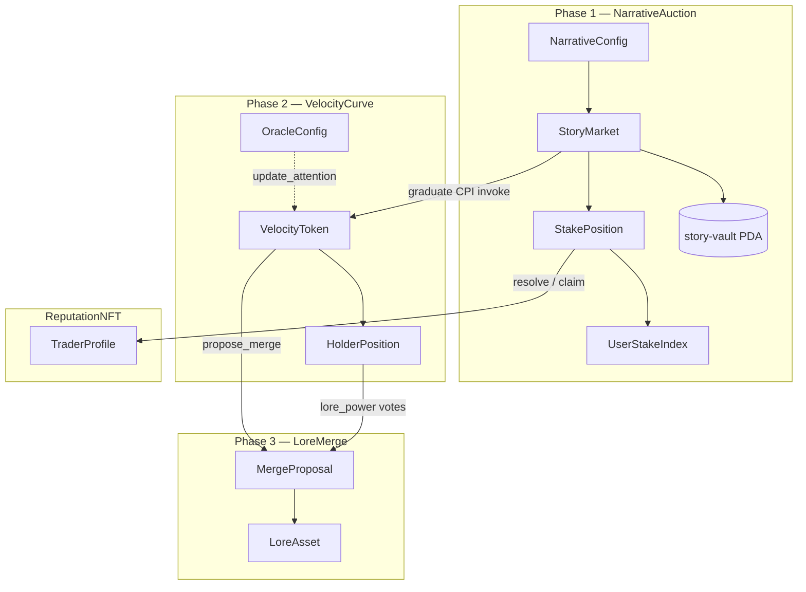

# Bonding Curve Casino — On-Chain Architecture

Founder overview of the Solana / Anchor programs that back the Story Markets UI.

> **Product insight:** traders bet on *narrative velocity* before tokens exist. Phase 1 is a prediction market on stories; Phase 2 tokenizes winners on a dual bonding curve; Phase 3 lets winners absorb failed lore.

---

## 1. Three phases + ReputationNFT

| Phase | Program | Role |
|-------|---------|------|
| **1 — Narrative Auction** | `narrative-auction` | Creators submit stories; users stake SOL; top narratives graduate (or fail) |
| **2 — Velocity Bonding Curve** | `velocity-curve` | Dual-curve AMM (price × attention); oracle-driven sell tax |
| **3 — Lore Merge** | `lore-merge` | Strong tokens absorb failed narratives via community vote |
| **Reputation** | `reputation-nft` | Dynamic trader profiles / tiers from prediction accuracy |

**Program IDs** (synced with `Anchor.toml` / `declare_id!`):

| Program | ID |
|---------|-----|
| NarrativeAuction | `75xWzXGb3A7UgpqDDL9ByVXpaZ8Zw4AF4i7whnVXyh8m` |
| VelocityCurve | `5VbDjccBDNVCPLpSgxyuw7ptYekrcxH8FySBxaAXx6C` |
| LoreMerge | `8pSr3X9iP66rvqMWT4S2gsEGtS8VnCLZtJayY9NB9ySy` |
| ReputationNFT | `DrzQKZpvg8y7Gymp5yz2upX24v3fV7j7eFuqT31Nxgvd` |

---

## 2. Account diagram



### PDA seeds (Phase 1)

| Account | Seeds |
|---------|-------|
| `NarrativeConfig` | `["narrative-config"]` |
| `StoryMarket` | `["story", creator, content_hash]` |
| Story vault | `["story-vault", story]` |
| `StakePosition` | `["stake", story, staker]` |
| `UserStakeIndex` | `["user-stakes", user]` — distinct open story stakes; enforces `max_stakes_per_user` |
| `RankingBoard` | `["ranking-board"]` |

### PDA seeds (Phase 2 — VelocityCurve)

| Account | Seeds |
|---------|-------|
| `VelocityToken` | `["curve", story_id]` |
| Curve vault | `["curve-vault", curve]` |
| `HolderPosition` | `["holder", curve, owner]` |
| `OracleConfig` | `["oracle-config"]` |

### PDA seeds (Phase 3 — LoreMerge)

| Account | Seeds |
|---------|-------|
| `MergeConfig` | `["merge-config"]` |
| `MergeProposal` | `["merge", absorber, target]` |
| `LoreAsset` | `["lore", origin_curve]` |
| `VoteRecord` | `["vote", proposal, voter]` |

### PDA seeds (ReputationNFT)

| Account | Seeds |
|---------|-------|
| `TraderProfile` | `["profile", owner]` |
| Metaplex metadata | `["metadata", metaqbxx…, mint]` (Token Metadata program) |

URI placeholder: `https://bcc.local/reputation/{tier}/{owner}.json` (replaceable off-chain host).

---

## 3. CPI / lifecycle flow

```
User stakes SOL
    ↓
NarrativeAuction::stake_on_narrative
    (2% fee → treasury, net → story vault)
    ↓  (auction ends_at)
┌─ threshold met + top rank ──▶ graduate_narrative(rank 1–5)
│                                    ↓ CPI invoke (live)
│                               VelocityCurve::initialize_token
│                                    ↓
│                               Oracle → update_attention (every ~5 min)
│
├─ threshold met, not top rank ──▶ forfeit_story
│                                    ↓
│                               contribute_losing_pool → winner winning_pool (20/80)
│
└─ below threshold ──▶ fail_story → resolve_stakes → claim_stake (reclaim)
                              ↓
                    ReputationNFT::update_profile (later)
```

**Graduate redistribution (losers → winner narrative):**

- **20%** of losing stakes → winner stakers (pro-rata) via `winner_bonus_pool`
- **80%** → `liquidity_reserve` for VelocityCurve initial liquidity

---

## 4. Fees

| Surface | Fee | Where |
|---------|-----|-------|
| Narrative Auction stake | **2%** (200 bps) | `NarrativeConfig.fee_bps` → treasury |
| Velocity Curve volume | **1.5%** (150 bps) | `CURVE_FEE_BPS` in velocity-curve |
| Lore Merge execution | **5%** (500 bps) | `MERGE_FEE_BPS` in lore-merge |

---

## 5. What's implemented vs stubbed

| Program | Accounts | Instructions | Logic |
|---------|----------|--------------|-------|
| **narrative-auction** | ✅ Full | ✅ 10 handlers | ✅ Real: config/update, story init, stake + fee, graduate + ranking board + **CPI invoke** to VelocityCurve (SPL mint) + **seed liquidity transfer** story vault → curve vault, fail/forfeit, contribute 20/80 pool, resolve math, claim |
| **velocity-curve** | ✅ Full | ✅ 10 handlers | ✅ Dual-curve math, SPL mint/burn buy/sell + 1.5% fee, attention EMA, holder rewards, **oracle 3/5** (tx-signer **or** ed25519 proof), **`settle_merge`** for LoreMerge |
| **lore-merge** | ✅ Full | ✅ 5 handlers | ✅ propose/vote/execute + lore init; 5% fee; history cap 10; **CPI `settle_merge`** moves vault SOL + sets `is_merged` / `merge_count` |
| **reputation-nft** | ✅ Typed | ✅ `initialize_profile` + `mint_reputation_nft` + `update_profile` + `add_trait` | ✅ Accuracy × Weighted_Volume_Factor + Bronze→Mythic tiers; Metaplex NFT via raw Token Metadata CPI |

NarrativeAuction critical checks encoded:

- Stake only while `Active` and `now < ends_at`; 2% (`fee_bps`) → treasury, net → vault; new positions enforce `max_stakes_per_user` via `UserStakeIndex`
- Graduate requires `ends_at` passed + threshold + `rank ∈ 1..=5` + unique `RankingBoard` slot
- Below threshold → `fail_story` (reclaim); at/above threshold but not top-ranked → `forfeit_story` + `contribute_losing_pool` (20/80)
- Resolve marks claimable: winners get principal + pro-rata 20% bonus; failed reclaim; forfeited claimable=0
- Claim preserves rent-exempt + `liquidity_reserve` on Graduated vaults
- **VelocityCurve CPI is invoked** on graduate (`initialize_token` with matching account metas incl. mint/vault/ATA)
- After CPI, **seed liquidity** (`liquidity_reserve`) is transferred story vault → curve vault; `liquidity_reserve` zeroed so claims stay correct

VelocityCurve critical logic:

- Spot price linearized exponential: `P(s) = base + (effective_k * s) / 1e6`; buy/sell via u128 integrals
- Attention = twitter×0.4 + telegram×0.3 + holders×0.3 (oracle passes components; program weights)
- Effective_k steepen/flatten per PDF (±25% clamp); sell tax 15% / 5%; tax 50/50 holders/treasury
- Protocol fee `CURVE_FEE_BPS = 150` (1.5%) on buy SOL in and sell SOL out
- `update_attention` EMA α=0.3; **two oracle modes** (see §9): tx-signer quorum **or** ed25519 Instructions-sysvar proof; authority can `set_oracle_quorum` / `add_oracle` / `remove_oracle`
- SPL mint created on `initialize_token` (authority = curve PDA); `buy` mints to buyer ATA; `sell` burns from seller ATA; `HolderPosition` kept for reward-index / lore_power
- `seed_liquidity` recorded at init; SOL actually moved by NarrativeAuction graduate into curve vault; `sol_reserve` seeded accordingly
- `settle_merge(fee, liquidity)`: PDA-signed vault transfers + `target.is_merged` + absorber `merge_count++`

LoreMerge critical logic:

- `initialize_lore_asset` registers lore for a VelocityToken curve (permissionless after graduate)
- `propose_merge` requires proposer `HolderPosition.balance` >1% of absorber `current_supply`; absorber lore age ≥7 days
- `vote_merge` weight = balance × (1 + lore_power bonus ≤50%); one `VoteRecord` per voter; quorum default 10% supply
- `execute_merge` after `voting_ends` + yes≥quorum + yes>no: transfer target lore → absorber, push history (cap **10**), bump `lore_power`, record **5%** fee + **90%** liquidity, **CPI VelocityCurve::settle_merge**, clear `settlement_pending`
- `lore_power` bump = 500 + min(target.lore_value / 1 SOL, 2000) bps units on absorber multiplier (base 10_000)

---

## 6. Relation to the Story Markets UI

The Vite React app under `src/` wires Phases 1–3 + Reputation with **chain-or-mock** fallbacks:

| UI surface | On-chain counterpart |
|------------|----------------------|
| Story Markets board / cards | `StoryMarket` accounts (phase, total_staked, ends_at) |
| Create Story form | `initialize_story(content_hash, duration)` |
| Stake panel on `/story/:id` | `stake_on_narrative(amount)` |
| `/trade` + TradeDesk | VelocityCurve `buy` / `sell` / `claim_holder_rewards` |
| `/merge` · `/merge/propose` · `/merge/:id` | LoreMerge propose / vote / execute + lore assets |
| Header badge · `/profile` | ReputationNFT `TraderProfile` (tier + accuracy) |
| Shared toast banner | Readable Anchor / wallet / RPC errors on create·stake·trade·merge |

Client helpers: `src/lib/solana/{merge*,reputation*}.ts` (PDAs match program seeds). Empty RPC → mock curves / merges / profile (same pattern as Story Markets / Trade).

---

## 7. Next steps

1. **Install toolchain** (once, on a machine with network):
   ```bash
   sh -c "$(curl -sSfL https://release.anza.xyz/stable/install)"
   cargo install --git https://github.com/coral-xyz/anchor avm --locked
   avm install 0.30.1 && avm use 0.30.1
   ```
2. **Generate real keypairs** and update `declare_id!` + `Anchor.toml`:
   ```bash
   anchor keys sync
   ```
3. **Build & test NarrativeAuction on localnet**:
   ```bash
   solana-test-validator   # separate terminal
   anchor build -p narrative_auction
   anchor deploy -p narrative_auction
   anchor test --skip-deploy   # or full anchor test
   ```
4. **Wire the frontend**: Solana wallet adapter, IDL JSON from `target/idl/`, replace mocks for list/stake.
5. ~~Implement VelocityCurve math + enable graduate CPI~~ ✅
6. ~~Oracle network 3/5 multi-sig crank~~ ✅ — ~~ed25519 sysvar proof~~ ✅ (both modes; see §9).
7. ~~Seed curve vault~~ ✅ — graduate transfers `liquidity_reserve` → curve vault after `initialize_token`.
8. ~~SPL mint / ATA~~ ✅ — mint on init; buy mints / sell burns; ~~Metaplex reputation NFT~~ ✅ (raw CPI).
9. ~~LoreMerge core (propose/vote/execute)~~ ✅ — ~~VelocityCurve settle CPI~~ ✅; SPL burn-mint claim window still deferred.
10. ~~UI trade + merge + reputation surfaces~~ ✅ — Metaplex mint wired (`mint_reputation_nft`).
11. **Indexer**: `indexer/` RPC-poll SQLite service + Yellowstone scaffold; set `VITE_INDEXER_URL` / `GEYSER_ENDPOINT` for prod.
12. **CI**: `.github/workflows/ci.yml` (frontend + cargo check; optional anchor BPF).
13. **Wesayso commercial license** — see `docs/WESAYSO_LICENSE.md` (blocker before public launch).

---

## Repo layout

```
bonding-curve-casino/
  ARCHITECTURE.md          ← this file
  Anchor.toml
  Cargo.toml               ← workspace
  .github/workflows/ci.yml ← frontend + cargo check (+ optional anchor BPF)
  docs/WESAYSO_LICENSE.md  ← commercial font checklist (launch blocker)
  docs/DEVNET.md           ← Devnet deploy checklist (tools-version v1.45)
  docs/CROSS_CHAIN.md      ← Base/Arbitrum mirror design (later)
  cross-chain/             ← Solidity stubs + L2 env placeholders
  .env.example             ← Vite cluster / program ID env template
  scripts/localnet-smoke.mjs
  programs/
    narrative-auction/     ← Phase 1 (full scaffold)
    velocity-curve/        ← Phase 2 (dual-curve + oracle 3/5)
    lore-merge/            ← Phase 3 (propose/vote/execute)
    reputation-nft/        ← Phase 4 profiles + Metaplex mint CPI
  indexer/                 ← SQLite RPC-poll indexer (+ Geyser scaffold)
  tests/                   ← TS flow stubs
  src/                     ← Vite React UI (Story / Trade / Merge / Profile)
  src/idl/                 ← checked-in IDL copies (target/ gitignored)
```

---

## 8. Infra / mainnet readiness

| Item | Status | Notes |
|------|--------|-------|
| **Oracle 3/5** | ✅ Done | `OracleConfig.quorum` (default 3), up to 5 `authorized_oracles`. Two modes — **tx-signer** (`proof` empty) or **ed25519** (`proof` = timestamp i64 LE + prior Ed25519Program ixs). See §9. Admin: `set_oracle_quorum` / `add_oracle` / `remove_oracle`. |
| **Indexer** | ✅ Scaffold | `indexer/` — SQLite via `sql.js` + RPC poll (`getProgramAccounts` / logs). HTTP: `GET /api/stories`, `/api/activity`, `/api/curves`. Yellowstone/Geyser plan in `indexer/README.md`; set `GEYSER_ENDPOINT` when available. Frontend: `useIndexerFeed` + LiveTicker prefers `VITE_INDEXER_URL`. |
| **CI** | ✅ In-repo | `.github/workflows/ci.yml` — required: Node 22 frontend build + `cargo check --workspace`; optional `anchor-build` (`continue-on-error`). Remote/push is a separate auth step. |
| **Wesayso font** | ⚠️ Blocker | Personal-use FontSpace font in `public/fonts/`. Buy commercial license before public launch — checklist in [`docs/WESAYSO_LICENSE.md`](./docs/WESAYSO_LICENSE.md). |

**Ops readiness**

- CI green (`.github/workflows/ci.yml` — frontend build + `cargo check`; optional Anchor BPF).
- Localnet smoke: `scripts/localnet-smoke.mjs` (validator + deployed programs; `RPC_URL` defaults to `http://127.0.0.1:8899`).
- Env templates: root `.env.example` (Vite) + `indexer/.env.example`; Devnet steps in [`docs/DEVNET.md`](./docs/DEVNET.md).
- **Pending:** real `GEYSER_ENDPOINT` (Yellowstone slot); Wesayso commercial license; optional public Devnet deploy (document-only until funded RPC/airdrop).

**Left for ops:** GitHub remote + push; real Yellowstone endpoint; purchase Wesayso commercial license; absorption burn-mint claim window; cross-chain relayer (see §10).

---

## 9. Oracle attestation modes + plumbing notes

### `update_attention` modes

| Mode | When | How quorum is met |
|------|------|-------------------|
| **Tx-signer** | `proof` is **empty** | `cranker` (if authorized) + `remaining_accounts` that are signers ∈ `authorized_oracles`; distinct count ≥ `quorum` |
| **Ed25519 offline** | `proof` is **non-empty** | `proof = timestamp (i64 LE)` (+ ignored bytes). Prior `Ed25519Program` instructions in the **same tx** must verify signatures over the canonical message. Instructions sysvar is introspected; distinct authorized pubkeys ≥ `quorum`. Bad proofs → `InvalidOracleProof` |

**Canonical message bytes** (64 total) — must match `velocity_curve::oracle_proof::canonical_message` and TS `encodeOracleCanonicalMessage`:

```text
curve_pubkey (32)
|| twitter_delta (u64 LE)
|| telegram_delta (u64 LE)
|| new_holders (u64 LE)
|| timestamp (i64 LE)
```

### Graduate → curve seed (A)

1. CPI `VelocityCurve::initialize_token` (creates curve PDA, SPL mint authority=curve, curve SOL vault, curve ATA).
2. `invoke_signed` transfer `liquidity_reserve` from story vault → curve vault.
3. Zero `StoryMarket.liquidity_reserve` so `claim_stake` rent math stays correct.

### SPL surface (B)

- Decimals = 6 (`TOKEN_DECIMALS`).
- `HolderPosition.balance` stays aligned with minted/burned amounts for rewards + LoreMerge votes.

### Merge settle (C)

- New ix: `settle_merge(fee_lamports, liquidity_lamports)`.
- LoreMerge `execute_merge` CPIs it with target/absorber vaults + treasury; clears `settlement_pending`.

---

## 10. Cross-chain later (Base / Arbitrum)

Phase **“cross-chain later”** — mirror Story Markets + VelocityCurve read state onto
Base and Arbitrum via message-passing (Wormhole / LayerZero / CCIP). Solana stays
canonical; L2 contracts are read-only mirrors in v1.

| Item | Location |
|------|----------|
| Design + message schema | [`docs/CROSS_CHAIN.md`](./docs/CROSS_CHAIN.md) |
| Solidity stubs | `cross-chain/solidity/IStoryMarketMirror.sol`, `IVelocityMirror.sol` |
| Env placeholders | `cross-chain/env/base.env.example`, `arbitrum.env.example` |

Not required for Solana localnet / Devnet launch.
